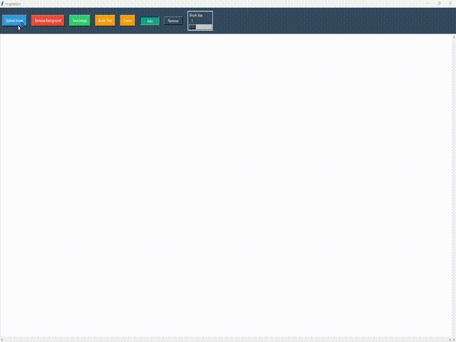

# Explanation of how remove background functionality works

## Datasets

for my model training I combined these three datasets that I found on kaggle regarding human image segmentations:

1. [Human Segmentation Dataset - Supervise.ly](https://www.kaggle.com/datasets/tapakah68/supervisely-filtered-segmentation-person-dataset)

2. [Human Segmentation Dataset - TikTok Dances](https://www.kaggle.com/datasets/tapakah68/segmentation-full-body-tiktok-dancing-dataset)

3. [Human Segmentation MADS Dataset, 1192 images](https://www.kaggle.com/datasets/tapakah68/segmentation-full-body-mads-dataset)

## Notebook

The notebook `remove_background.ipynb` contains the code for the model training and preprocessing of the data. The model is trained using a model based on the U-net architecture. The model is trained on the combined dataset of the three datasets mentioned above. I trained the model on kaggle using their GPUs, that is why the directories within the notebook are set up for kaggle. After training the model I just downloaded the weights and the notebook to my device to add the functionality to the app by loading the weights and using the model to remove the background of the image.

## Example of the model in action

## Notes on improving the model

Maybe creating a detection model that detects the subject and creates a bounding box over it, then cropping/padding it into a square and resizing it to the input size of the model could improve the model's performance. This way the model would only have to focus on the subject and not the background. Also multiple segmentation models could be trained on different sizes of found bounding boxes to improve the model's performance.
